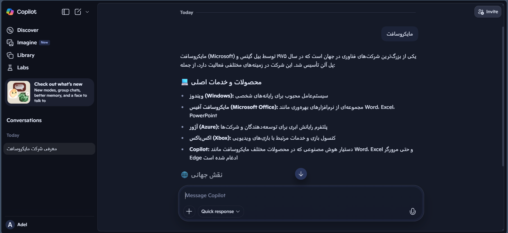
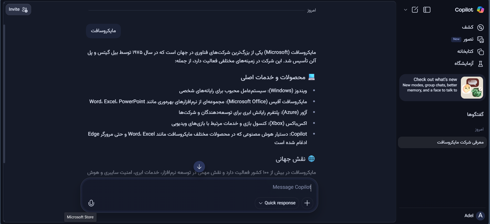

# رون (ravon) — بهبود خوانایی صفحات فارسی

رون یک بوکمارکلت کوچک و کاربردی است که با یک کلیک، صفحات فارسی را راست‌چین می‌کند و فونت وزیر را روی آن‌ها اعمال می‌کند.  
هدف این ابزار، افزایش خوانایی متون فارسی در وب است — مخصوصاً در صفحاتی که به‌درستی از زبان فارسی پشتیبانی نمی‌کنند.

---

## 🧩 بوکمارکلت چیست؟

بوکمارکلت (Bookmarklet) یک قطعه کد جاوااسکریپت است که مثل یک لینک در نوار بوکمارک مرورگر ذخیره می‌شود.  
اما به‌جای اینکه شما را به یک سایت ببرد، خودش روی صفحه‌ی فعلی کاری انجام می‌دهد.  
در مورد رون، این کار شامل راست‌چین‌سازی محتوا و اعمال فونت وزیر است — بدون نیاز به نصب افزونه یا نرم‌افزار خاص.

---

## 🎯 قبل و بعد از رون

در تصاویر زیر می‌توانید ببینید که رون چه تغییری در ظاهر صفحه ایجاد می‌کند:

| قبل | بعد |
|-----|-----|
|  |  |

---

## 🚀 چطور از رون استفاده کنیم؟

۱. فایل [`ravon.js`](./ravon.js) را باز کرده و کل کد داخل آن را کپی کنید.  
۲. در مرورگر خود، یک بوکمارک جدید بسازید.  
۳. در قسمت URL یا Location، کد کپی‌شده را جای‌گذاری (paste) کنید.  
۴. نام بوکمارک را «رون» یا هر نام دلخواهی بگذارید.  
۵. حالا هر وقت در صفحه‌ای فارسی بودید که راست‌چین نبود یا فونت ناخوانایی داشت، فقط روی بوکمارک کلیک کنید!

> نکته: اگر فونت وزیر روی سیستم شما نصب نباشد، رون به‌صورت خودکار آن را از اینترنت بارگذاری می‌کند.

---

## 🧵 نصب فونت وزیر (اختیاری)

برای استفاده‌ی محلی از فونت وزیر، می‌توانید آن را از [صفحه‌ی رسمی وزیر در گیت‌هاب](https://github.com/rastikerdar/vazir-font) دریافت و نصب کنید.  
البته رون به‌طور پیش‌فرض از نسخه‌ی آنلاین فونت استفاده می‌کند، پس نیازی به نصب دستی نیست.

---

## 🤝 مشارکت و بازخورد

اگر پیشنهادی برای بهبود رون دارید یا با مشکلی مواجه شدید، خوشحال می‌شوم از طریق بخش Issues یا Pull Requests در گیت‌هاب با من در ارتباط باشید.  
این پروژه آزاد و قابل توسعه است و از مشارکت‌های شما استقبال می‌شود.

---

## 🤖 چرا این ابزار ساخته شد؟

رون در ابتدا برای استفاده در کنار برخی ابزارهای هوش مصنوعی طراحی شد — ابزارهایی که حتی با نصب افزونه‌ها هم از راست‌چین‌سازی پشتیبانی نمی‌کردند.  
اما در عمل، روی هر صفحه‌ی فارسی که مشکل راست‌چین بودن یا فونت ناخوانا دارد، قابل استفاده است.

---
